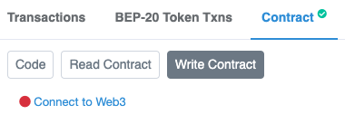
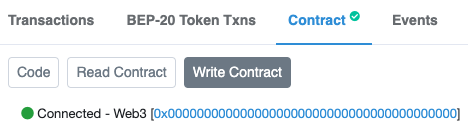
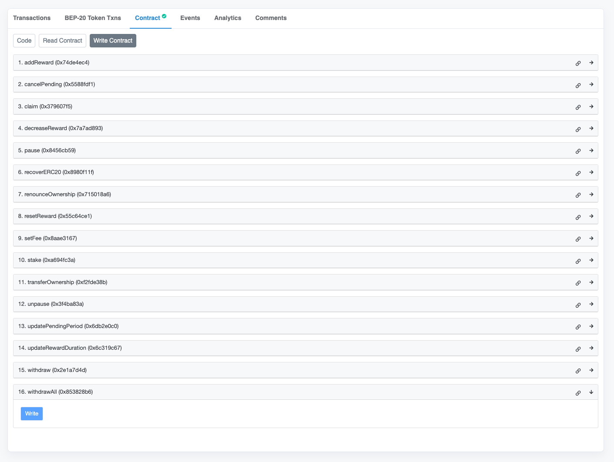
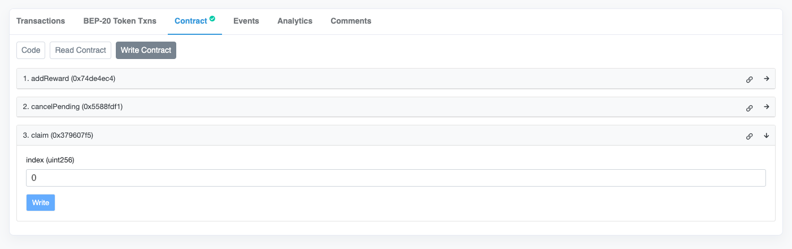

# Unstaking Guide

In this guide we will go over the process of unstaking your Samurai Legends tokens. This guide assumes you have already staked your tokens and are ready to unstake them.

## Step 1: Navigate to Smart Contract on BSCScan

Navigate to the Smart Contract for [Samurai Legends Staking](https://bscscan.com/address/0x94fAb5C81E760B32d14aD70Cf5c79a4BdA702981) on BSCScan.

## Step 2: Connect your Wallet

Connect your wallet to BSCScan by clicking the `Connect to Web3` button. Make sure you are connected to the **same wallet** you used to stake your tokens.

The button should now say `Connected` with your wallet address. If it does not, try refreshing the page and reconnecting your wallet.

## Step 3: Start the withdrawal process

Before you can claim your tokens, you will need to start the withdrawal process. To do this, follow the steps below:

1. Click the `Write Contract` tab
2. Expand the function `withdrawAll` (no. 16)
3. Click the `Write` button
4. Click the `Confirm` button on your wallet
5. Wait for the transaction to be confirmed

## Step 4: Claim your tokens

Finally, to claim your tokens, follow the steps below:

1. Click the `Write Contract` tab if you are not already on it
2. Expand the function `claim` (no. 3)
3. Enter the value `0` in the `index` field
4. Click the `Write` button
5. Click the `Confirm` button on your wallet
6. Wait for the transaction to be confirmed

You should now have your tokens in your wallet. To verify this, you can check your wallet balance on [BSCScan](https://bscscan.com/).

_(We have omitted the other functions in the image above for clarity.)_